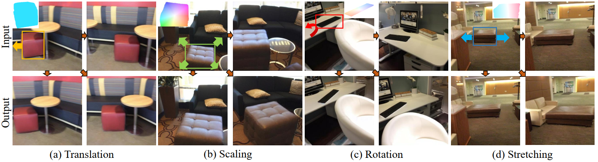

# MotionDiff: Training-free Zero-shot Interactive Motion Editing via Flow-assisted Multi-view Diffusion (ICCV-25)





## Introduction

This repository contains the official PyTorch implementation for the **ICCV 2025** paper titled "MotionDiff: Training-free Zero-shot Interactive Motion Editing via Flow-assisted Multi-view Diffusion" by Yikun Ma, Yiqing Li, Jiawei Wu, Xing Luo and Zhi Jin.


## Abstract

Generative models have made remarkable advancements and are capable of producing high-quality content. However, performing controllable editing with generative models remains challenging, due to their inherent uncertainty in outputs. This challenge is praticularly pronounced in motion editing, which involves the processing of spatial information. While some physics-based generative methods have attempted to implement motion editing, they typically operate on single-view images with simple motions, such as translation and dragging. These methods struggle to handle complex rotation and stretching motions and ensure multi-view consistency, often necessitating resource-intensive retraining. To address these challenges, we propose MotionDiff, a training-free zero-shot diffusion method that leverages optical flow for complex multi-view motion editing. Specifically, given a static scene, users can interactively select objects of interest to add motion priors. The proposed Point Kinematic Model (PKM) then estimates corresponding multi-view optical flows during the Multi-view Flow Estimation Stage (MFES). Subsequently, these optical flows are utilized to generate multi-view motion results through decoupled motion representation in the Multi-view Motion Diffusion Stage (MMDS). Extensive experiments demonstrate that MotionDiff outperforms other physics-based generative motion editing methods in achieving high-quality multi-view consistent motion results. Notably, MotionDiff does not require retraining, enabling users to conveniently adapt it for various down-stream tasks.


## Installation

1. You can follow the environment setup guide provided by https://github.com/dangeng/motion_guidance/ and https://github.com/PKU-EPIC/MaskClustering to install the envs.

2. We use SD-1.5 as the baseline diffusion model https://huggingface.co/stable-diffusion-v1-5/stable-diffusion-v1-5

   

## Demo
Down the demo data from: https://pan.baidu.com/s/1bLLbHqb3o5ysXsic5Pnd7w?pwd=8888 
pass: 8888 

You can run the following code to quickly reproduce our results. 

```
python ./generate_test.py --prompt "" --input_dir ./data/08_lashen --save_dir results/08_lashen --log_freq 25 --batch_size_num 4
```

To balance better editing results and faster editing speed, you can manually adjust parameters such as those of DDIM steps and the gradient intensity.


## Full Running

### 1. Segmentation

First, segment a 3D scene using Mask Clustering, more details please refer to the original code https://github.com/PKU-EPIC/MaskClustering.  We use the Scannet dataset.

```
cd MC/

python run.py --config scannet
bash demo.sh
python -m visualize.vis_scene --config demo --seq_name xxx

cd data/vis/xxx
python -m http.server 6008

# Open in browser for vis      
http://localhost:6008
```

### 2. Using GUI

Then, obtain the single-view optical flow and the warp image from GUI. 

Among them, we use the SAM https://github.com/facebookresearch/segment-anything, and you need to download the corresponding weights. 

```
cd gui/
python gui.py

cd warp/
python warp.py
```

### 3. Multi-view optical flows

Then, we propose PKM to predict multi-view optical flows. 

Before running the code below, you need to first process the segmentation information of the 3D scene, and then select the object ID and images. 

The preprocessed data will be released later, you can use our demo data for now. 

```
python Render/multi_flow.py
```

### 4. DDIM Inversion

Then, using DDIM Inversion to save the background texture of an image.

```
python DDIMins/preprocess.py --data_path /path/img --save_dir /path/latents_x --inversion_prompt ""
```

### 5. Get results

Finalle, you can run the python code of demo to obtain multi-view editing results.

```
python ./generate_test.py --prompt "" --input_dir ./data/your_data --save_dir results/your_save_dir --log_freq 25 --batch_size_num 4
```


# Acknowledgement

This work was supported by [Frontier Vision Lab](https://fvl2020.github.io/fvl.github.com/), SUN YAT-SEN University.

# Citation

If you find this work helpful, please consider citing:

```
@article{ma2025motiondiff,
  title={MotionDiff: Training-free Zero-shot Interactive Motion Editing via Flow-assisted Multi-view Diffusion},
  author={Ma, Yikun and Li Yiqing and Wu Jiawei and Luo Xing and Jin, Zhi},
  journal={arXiv preprint arXiv:2503.17695},
  year={2025}
}
```

Feel free to reach out for any questions or issues related to the project. Thank you for your interest!

